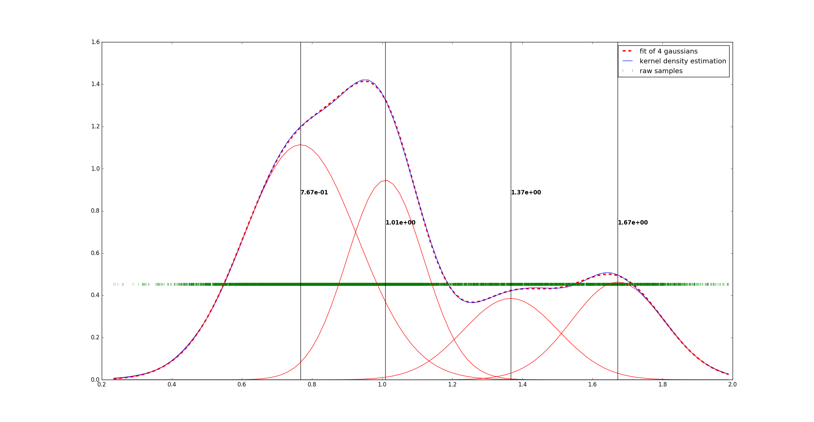

Peakdetext detects peaks in data. Was originally created to find gaussian peaks in fluorescence spectra.

You can get a description of the possible arguments through
```
python peakdetect.py -h
```

`example.dat` contains samples taken from 4 overlapping gaussian distributions generated using `generate_example.py`.
To analyze this data, run
````
python peakdetect.py example.dat
````

The result should look like this

